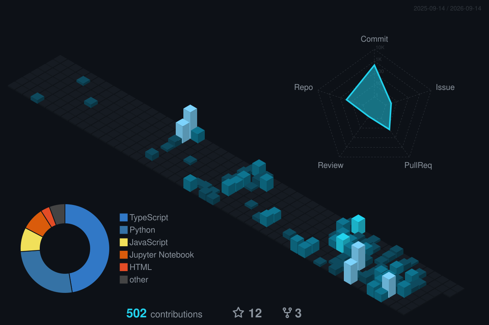

# profile automation

The scheduled jobs that keep [my profile README](https://github.com/Divyansh2602)
alive — regenerating the contribution artwork every night and keeping the live
stat cards from going stale.

## Generated artwork

| | |
|---|---|
| **3D skyline** |  — bundles the skyline, a commit-activity radar, and a language-mix pie in one image |
| **Snake** |  |

All themed to the same cyan/void palette as the profile and portfolio
(`#0d1117` ground, `#22d3ee` accent).

## Workflows

| Workflow | Schedule | Does |
|---|---|---|
| [`3d-contrib.yml`](.github/workflows/3d-contrib.yml) | daily, 00:10 UTC | Renders the 3D skyline (radar + language pie bundled in), commits it to `main` |
| [`snake.yml`](.github/workflows/snake.yml) | daily, 00:00 UTC | Renders light + dark contribution snakes, publishes to the `output` branch |
| [`refresh-cache.yml`](.github/workflows/refresh-cache.yml) | every 6 h | Purges GitHub's image cache so the profile shows current data |

## The stale-image problem

Worth writing down, because the symptom is misleading: **every workflow can be
green while the profile still shows old artwork.**

GitHub doesn't hotlink README images. It proxies each one through
`camo.githubusercontent.com` and caches the result aggressively. So a workflow
can regenerate an SVG, commit it, and report success — while visitors keep
getting the cached copy for hours. Nothing has failed; the picture is just old.

Camo honours an HTTP `PURGE`, so [`scripts/purge-camo.sh`](scripts/purge-camo.sh)
scrapes the camo URLs out of the rendered profile page and purges each one, in
parallel. It runs after the snake and 3D jobs publish, and on its own schedule
in between.

That last part matters more than it looks. The snake and 3D graph are files in
this repo, so they only change once a day. But the profile also pulls **live**
cards — commit stats, streak, activity graph, trophies — that are generated on
request and change continuously. Nothing regenerates those; the only thing that
ever made them look stale was the proxy in front of them. Hence a purge job on
its own six-hour cadence, independent of the two generators.

## Notes

- Purging is best-effort. A failed purge is logged as a warning, not an error —
  that asset just keeps its existing TTL and refreshes on the next pass.
- The 3D job pushes to `main` with a rebase-and-retry loop, so a scheduled run
  can't lose to a concurrent commit.
- GitHub disables scheduled workflows on repositories with 60 days of no
  activity. The nightly commits here keep that from triggering.
- Palette lives in [`conf/3d-contrib-settings.json`](conf/3d-contrib-settings.json).
  It can be an array to render more variants — a `radar_contrib_only` or
  `pie_lang_only` type would add a *second* standalone image — but `normal`
  already bundles both into `profile-cyberpunk.svg`, so adding those here
  would just duplicate what's already in the one file.

## Credits

[`yoshi389111/github-profile-3d-contrib`](https://github.com/yoshi389111/github-profile-3d-contrib)
· [`Platane/snk`](https://github.com/Platane/snk)
